# S.P.A.R.K (Smart Project Automation Resourceful Knowledgeable)


## Overview

This project created by **Adacademy** students is an assistant capable of performing various tasks such as answering questions, creating web projects, generating documents and searching youtube videos. The assistant uses Google's Gemini AI through its API key for text generation.

## Description 

- the project uses a class called Assistant, with which we can facilitate programming and add new features such as:

  - **Speech integration:** Uses Vosk's Speech-to-Text model to convert speech to text and Google Text-to-Speech to convert text to speech.

  - **AI responses:** Uses Gemini's API key to generate responses or content based on user requests.

  - **Task Automation:** this project helps in creating web projects, Word documents and creating PowerPoint presentations.

  - **Content Search:** This wizard also facilitates content search, such as searching for YouTube videos on a topic that the user indicates.


## Dependences

This Wizard uses libraries that you will need to install in order to use it: 

- **Google.generativeai:** this library is used to load the Gemini 2.0 Flash AI model.

  ```bash
  pip install googelgenerativeai
  ```

- **Vosk:** this is the speech recognition model

  ```bash
  pip install vosk
  ```

- **gTTS:** this is the Google model that converts speech to text

  ```bash
  pip install gtts
  ```

- **Playsound:** used to play the user's own audio files

  ```bash
  pip install playsound
  ```

- **Sounddevice:** used to record the user's audio input

  ```bash
  pip install sounddevice
  ```

- **Requests:** used to make the HTTP requests necessary for searching YouTube videos

  ```bash
  pip install request
  ```

- **Python-docx and pptx:** are the libraries needed for the creation of Word documents and PowerPoint presentations

  ```bash
  pip install python-docx, python-pptx
  ```

- **Pytube:** are the package that allows downloads videos of Youtube.

  ```bash
  pip instal pytube
  ```

## Module Description:

The asistente class contains the following methods which are the functions that the asistente has:

| Method                     | Arguments                     | Returns               | Description                                                                 |
|----------------------------|-------------------------------|-----------------------|-----------------------------------------------------------------------------|
| 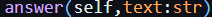                 | text                        | text                | Answers any questions the user asks                                         |
| 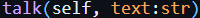                   | text                        | audio               | Converts the given text to speech for the user to hear                      |
|              | None                        | text                | Returns a transcript of the user's speech input                             |
| 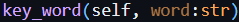                | None                        | None                | Listens passively and only reacts when a specific keyword is detected       |
| 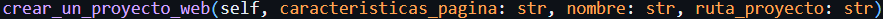       | features, name, projectPath | Web project         | Generates HTML code for a themed webpage and opens it in VSCode             |
|          | features, name, projectPath | Word Document       | Creates a Word document on the specified theme                              |
|      | theme                       | PPTX presentation   | Generates a PowerPoint presentation on the chosen topic                     |
| 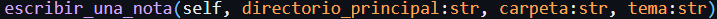              | directory, folder, theme    | text file           | Creates a Notepad file with notes on the specified topic                    |
| 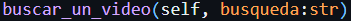            | searchQuery                 | YouTube link        | Finds the first YouTube video for the query and opens it in the browser     |
| 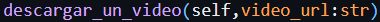          | searchQuery, savePath       | video file          | Downloads the first YouTube video found for the given search query          |

## Getting Started

**Step 1:** Open you browswer

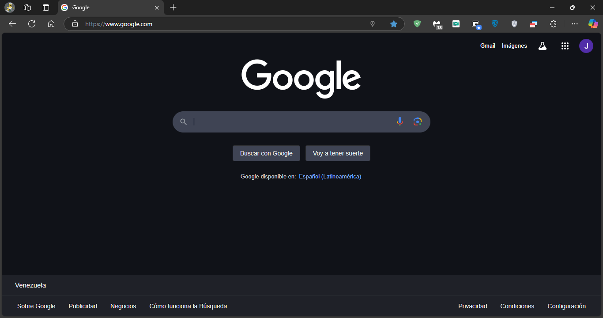

**Step 2:** search "Google AI Studio"

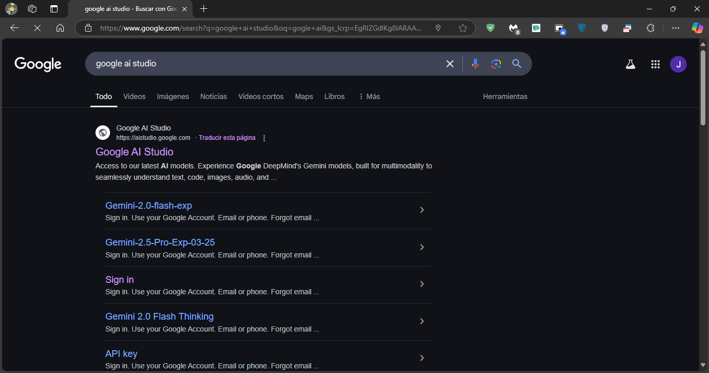

**Step 3:** sign in in your Google account

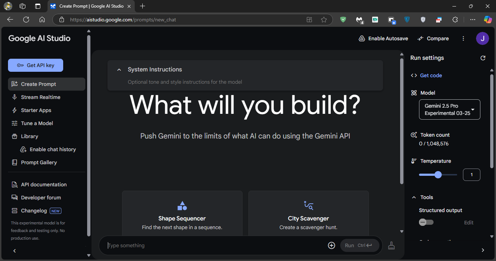

**Step 4:** Click on "Get API key"

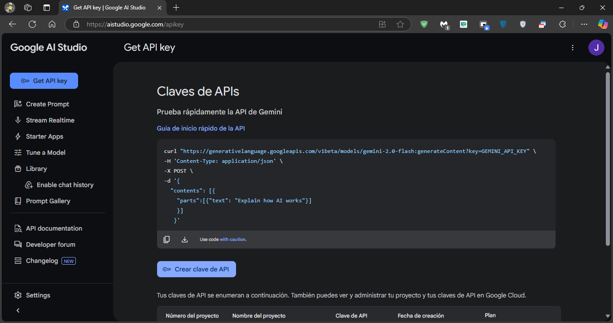

**Step 5:** Click on "Create API key" or "Crear clave de API"

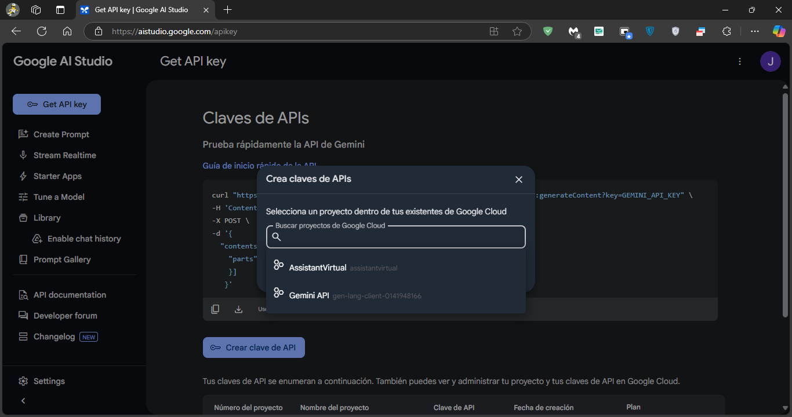

**Step 6:** Click on "Gemini API" or in the name of your project

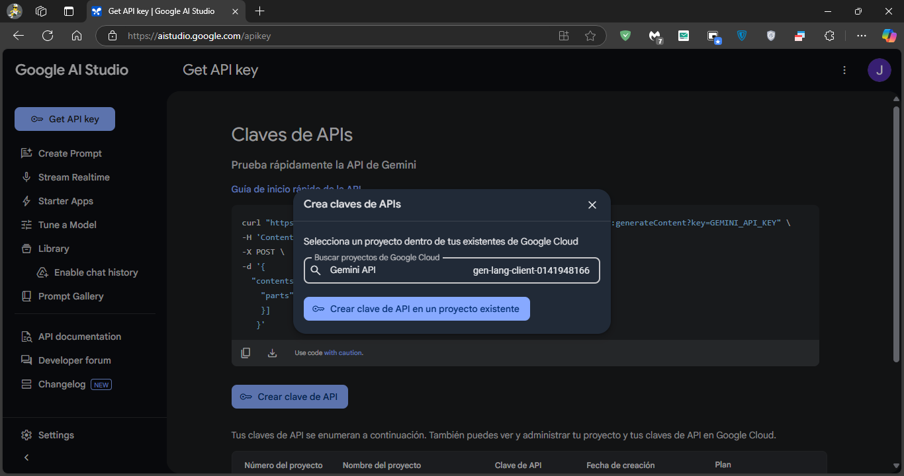

**Step 7:** Finally, click on create API key

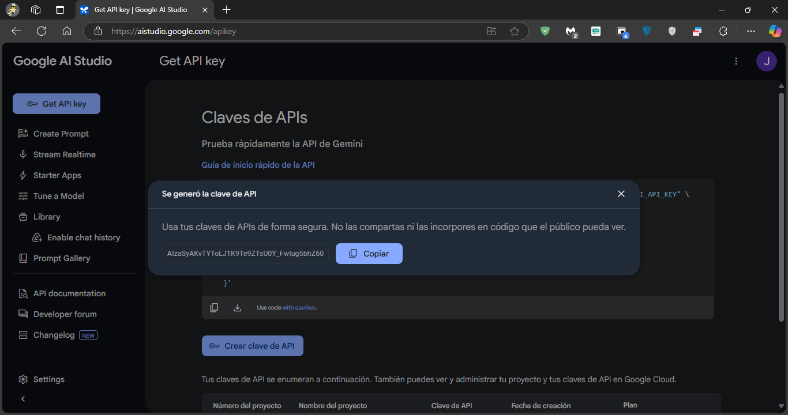

and that's it, now you have your Gemini API key.

## 💖 Support the Project
If you find this project useful, consider supporting it through donations. Your contributions help maintain and improve the project!
### **Donation Methods:**
- Pago Movil
- Paypal
- Crypto

